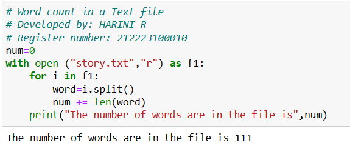

# EX08 Word-Count
## AIM:
To write a python program for getting the word count from a text.
## EQUIPEMENT'S REQUIRED: 
PC
Anaconda - Python 3.7
## ALGORITHM: 
### Step 1:
Start the program.
### Step 2: 
Create a file story.txt in anaconda navigator.
### Step 3: 
Write a program to count the number of words in a text file.
### Step 4:  
Run the program.
### Step 5: 
Print the output.
### Step 6: 
End the program.
## PROGRAM:
```
# Word count in a Text file
# Developed by: HARINI R
# Register number: 212223100010
num=0
with open ("story.txt","r") as f1:
    for i in f1:
        word=i.split()
        num += len(word)
    print("The number of words are in the file is",num)
```
### OUTPUT:



## RESULT:
Thus the program is written to find the word count from a text.
